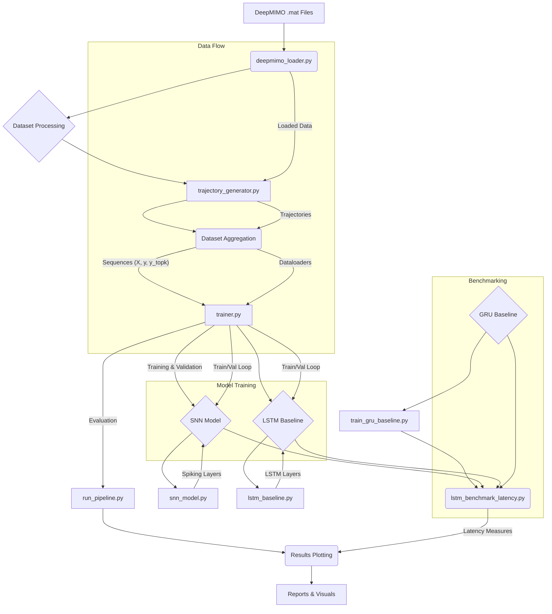

# REAP-6G: Recurrent Spiking Neural Networks for Predictive Beam Switching in 6G

REAP-6G explores the application of recurrent Spiking Neural Networks (SNNs) for ultra-low-latency predictive beam switching in 6G millimeter-wave (mmWave) communication systems. Leveraging DeepMIMO datasets and SNNTorch, this project demonstrates real-time beam tracking with remarkable energy efficiency, comparing SNN performance against traditional LSTM and GRU baselines.

## 🚀 Features

-   **Spiking Neural Network (SNN) Implementation**: Utilizes `snntorch` for building and training recurrent SNNs.
-   **DeepMIMO Dataset Integration**: Tools for loading and processing large-scale DeepMIMO v4 datasets.
-   **Mobility Modeling**: Supports a variety of user mobility patterns (linear, random-walk, L-shaped, circular, highway) to generate realistic trajectories.
-   **Predictive Beam Switching**: Implements a novel SNN-based approach to predict optimal beam indices for dynamic environments.
-   **LSTM and GRU Baselines**: Training and evaluation scripts for traditional recurrent neural networks to benchmark SNN performance.
-   **Latency Benchmarking**: Dedicated scripts to measure inference latency on both CPU and GPU for SNN, LSTM, and GRU models.
-   **Comprehensive Evaluation**: Metrics include Top-1/Top-K accuracy, beam switch rate, and spectral efficiency.
-   **Automated Configuration**: `inspect_dataset.py` helps automatically configure dataset paths and parameters.
-   **Detailed Logging & Visualization**: Generates training history, evaluation plots, and detailed reports.

## 🏗️ Architecture



## 📊 Results

**REAP-6G Performance and Efficiency Metrics**

### Beam prediction accuracy

| Metric | Value |
|--------|-------|
| LSTM Baseline Accuracy | 97.30% |
| GRU Baseline Accuracy | 97.71% |
| **Top-1 Prediction Accuracy (SNN)** | **95.76%** |
| Top-3 Prediction Accuracy (SNN) | 99.63% |
| Top-5 Prediction Accuracy (SNN) | 99.88% |

### Spectral efficiency

| Metric | Value |
|--------|-------|
| Oracle (Ground Truth) SE | 6.658 bits/s/Hz |
| **SNN Predicted SE** | **6.641 bits/s/Hz** |
| Random Baseline SE | 2.334 bits/s/Hz |
| **SE Gain vs. Random Baseline** | **+184.5%** |

### Handover stability

| Metric | Value |
|--------|-------|
| Avg. Beam Switches / Trajectory | 2.0 |
| Handover Oscillation Rate | 0.0200 |

**Key finding:** REAP-6G's SNN achieves spectral efficiency of 6.641 bits/s/Hz — within **0.26%
of the oracle upper bound** — while delivering a **+184.5% SE gain** over random beam selection.
Top-3 accuracy of 99.63% ensures robust beam coverage with minimal handover oscillation,
meeting 6G ultra-low-latency requirements.

## 💻 Tech Stack

-   **Python**: Primary programming language.
-   **PyTorch**: Deep learning framework for model implementation and training.
-   **SNNTorch**: Extension for building and training spiking neural networks.
-   **NumPy**: Numerical operations, especially for data processing.
-   **SciPy**: For `.mat` file loading and scientific computing.
-   **Matplotlib**: For plotting and visualization of results.
-   **Tqdm**: For progress bars during training and data loading.

## 📁 Project Structure

```
.
├── benchmark_gru_latency.py
├── dataset_config.py
├── deepmimo_loader.py
├── inspect_dataset.py
├── lstm_baseline.py
├── lstm_benchmark_latency.py
├── requirements.txt
├── run_pipeline.py
├── snn_model.py
├── train_gru_baseline.py
├── trainer.py
└── trajectory_generator.py
```

## ⚙️ Getting Started

### Prerequisites

Ensure you have Python 3.8+ installed.

### Installation

1.  **Clone the repository:**
    ```bash
    git clone https://github.com/shreeg25/REAP-6G.git
    cd REAP-6G
    ```

2.  **Create a virtual environment (recommended):**
    ```bash
    python -m venv venv
    source venv/bin/activate  # On Windows, use `venv\Scripts\activate`
    ```

3.  **Install dependencies:**
    ```bash
    pip install -r requirements.txt
    ```

### Configuration

#### 1. Dataset Configuration

Before running any pipelines, you need to configure your DeepMIMO dataset path and parameters.

Run the `inspect_dataset.py` script:
```bash
python inspect_dataset.py --data_dir "G:\Shree\6G Beam Switching enabled by SNN\6G Dataset creation\deepmimo_scenarios\O1_140"
```
This will:
- Scan your DeepMIMO directory.
- Print a summary of discovered parameters, time snapshots, and transmitter indices.
- Attempt to peek inside `.mat` files to infer internal variable names.
- **Generate `dataset_config.py`** in the project root with the inferred settings.

**Important**: Review and edit `dataset_config.py` if the auto-detected `DATA_DIR` or `PARAM_KEY_MAP` are incorrect for your setup. Specifically, verify `DATA_DIR` and `FEATURE_PARAMS`.

#### 2. Main Pipeline Configuration

Open `run_pipeline.py` and adjust the following variables at the top to match your environment and desired experiment settings:

-   `DATA_DIR`: Your DeepMIMO dataset path (should match `dataset_config.py`).
-   `RESULTS_DIR`: Directory where all output logs, models, and plots will be saved.
-   `N_TRAJ`: Number of user trajectories to generate.
-   `N_STEPS`: Number of time steps per trajectory.
-   `SEQ_LEN`: Input sequence length for the SNN (and RNN baselines).
-   `N_BEAMS`: Size of the beam codebook (e.g., 64).
-   `EPOCHS`, `LR`, `BATCH`: Training hyperparameters.
-   `T_INDEX`, `TX_INDEX`: DeepMIMO time snapshot and base station indices to use.
-   `LAMBDA_SPK`, `LAMBDA_TOPK`: Hyperparameters for the SNN loss function (for ablation studies).

### Running the Pipeline

To run the full SNN training, evaluation, and plotting pipeline:
```bash
python run_pipeline.py
```
This script will:
1.  Load the DeepMIMO dataset (or generate synthetic data if `DATA_DIR` is not found).
2.  Generate user mobility trajectories.
3.  Train the Recurrent Beam SNN model.
4.  Evaluate the SNN's performance on generated trajectories.
5.  Generate various plots and save results to the `RESULTS_DIR`.

### Running Baselines and Benchmarks

-   **Train and evaluate LSTM baseline:**
    ```bash
    python lstm_baseline.py
    ```

-   **Train and evaluate GRU baseline:**
    ```bash
    python train_gru_baseline.py
    ```

-   **Benchmark SNN and LSTM inference latency:**
    ```bash
    python lstm_benchmark_latency.py
    ```
    This script will compare the `LSTMBeamTracker` from `lstm_baseline.py` and the `RecurrentBeamSNN` from `snn_model.py`.

-   **Benchmark GRU inference latency:**
    ```bash
    python benchmark_gru_latency.py
    ```

## Environment Variables

Although not explicitly loaded from an `.env` file, the `dataset_config.py` file effectively acts as a configuration source for `DATA_DIR`.

-   `DATA_DIR` (in `dataset_config.py` and overridden in `run_pipeline.py`): Path to your DeepMIMO dataset. Example: `G:\Shree\6G Beam Switching enabled by SNN\6G Dataset creation\deepmimo_scenarios\O1_140`

## 👋 Contributing

Contributions are welcome! Please follow these steps:

1.  Fork the repository.
2.  Create a new branch for your feature or bug fix: `git checkout -b feature/your-feature-name` or `bugfix/issue-description`.
3.  Implement your changes and ensure they adhere to the existing code style.
4.  Write or update relevant tests.
5.  Commit your changes and push to your fork.
6.  Open a Pull Request to the `main` branch of this repository.
